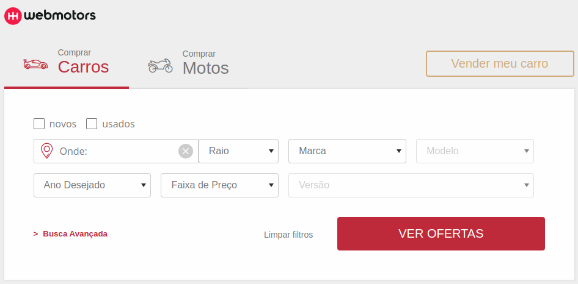

<h1 align="center">
    
</h1>

## Index

- [Features](#features)
- [Getting started](#getting-started)
- [Starting project](#starting-project)
- [Running tests](#running-tests)

## Features

This app features all the latest tools and practices in web development!

- ReactJS
- Redux - Redux Sagas
- Axios
- Styled-Components
- Jest/React Testing Library
- Typescript

## Getting started

```bash
Clone this repo using:
$ git clone git@github.com:wellingtondw/teste.git

Move yourself to the appropriate directory:
$ cd teste

To install dependencies:
$ yarn

```

## Starting project

```bash
$ yarn start
```

## Running tests

```bash
$ yarn test
$ yarn test:watch
```
